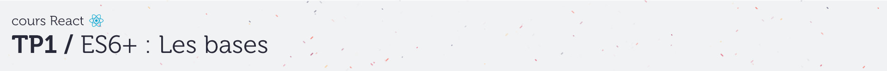
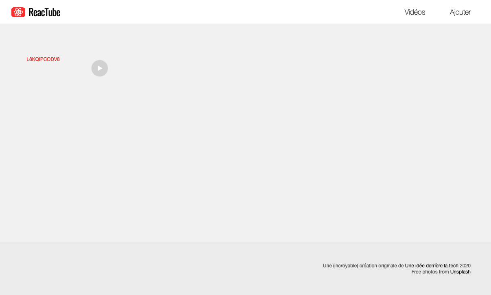
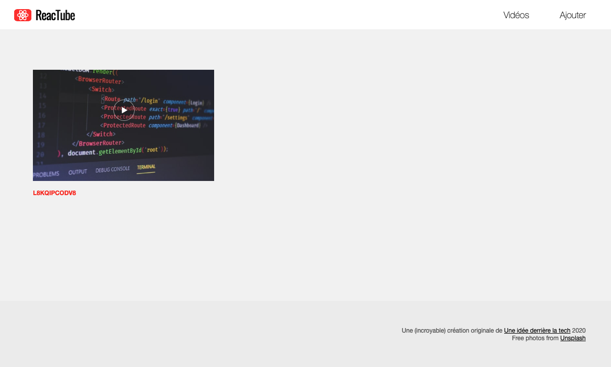

# D. Les chaînes de caractères <!-- omit in toc -->

## Sommaire <!-- omit in toc -->
- [D.1. Note à propos d'EcmaScript](#d1-note-à-propos-decmascript)
- [D.2. Rappels sur les chaînes en JS](#d2-rappels-sur-les-chaînes-en-js)
- [D.3. Manipulations simples](#d3-manipulations-simples)
- [D.4. Injection dans la page HTML](#d4-injection-dans-la-page-html)

## D.1. Note à propos d'EcmaScript

### Pour tous les TP vous coderez en ES6+ ! <!-- omit in toc -->

**Dans un premier temps, pour se familiariser avec JavaScript, nous ne nous soucierons pas du support navigateur des syntaxes EcmaScript que l'on va utiliser. Ce que vous pourrez utiliser ou pas dépend de la version de votre navigateur.**

Consultez le support navigateur des différentes fonctionnalités EcmaScript ici :

- pour ES6 : http://kangax.github.io/compat-table/es6/
- pour ES7, ES8, ES9, etc. (ES2016+) : http://kangax.github.io/compat-table/es2016plus/
- pour les features en cours de spécification (comme les propriétés de classes, ou le mot clé `static`) : http://kangax.github.io/compat-table/esnext/

Ceci étant dit, tout ce qui a été vu en cours jusqu'ici est compatible avec les dernières versions de Chrome/Chromium !

> _**NB :** Dans la vraie vie se reposer sur la version du navigateur de l'utilisateur est trop "risqué", on utilisera donc par la suite le compilateur [Babel](https://babeljs.io) pour rendre notre code compatible avec tous les navigateurs. Pour l'instant on va mettre de côté cette problématique pour ce concentrer sur le code, nous y reviendrons dans la suite du TP._


## D.2. Rappels sur les chaînes en JS
_**Pour rappel il existe 3 manières de déclarer des chaînes de caractères en JS :**_
```js
/* guillemets simples */
let s1 = 'je suis une chaîne avec des single quotes';

/* ou guillemets doubles */
let s2 = "je suis une chaîne avec des double quotes";

/* ou accent grave (template strings ES6) */
let s3 = `Les étudiants de ${ getCurrentSchool() } sont les meilleurs`;
```
Les templates strings sont à privilégier si vous devez injecter des valeurs dynamiques dans la chaîne ou si vous souhaitez la déclarer sur plusieurs ligne.

Si ce n'est pas le cas, le choix entre guillemets simples ou double est une question de préférences (_les goûts et les couleurs..._), la seule contrainte est qu'une fois qu'on a fait un choix, il faut s'y tenir (conventions de code). Entre guillemets doubles ou simples, ma préférence va aux guillemets simples qui évitent de devoir échapper les double quotes (_souvent utilisées lorsqu'on génère du code HTML_).


## D.3. Manipulations simples
**Entrons dans le vif du sujet :**

1. **Dans le fichier `src/main.js`, créez une constante appelée `thumbnail`** et assignez lui la chaîne de caractères `'L8KQIPCODV8'`
1. **Créez une deuxième constante nommée `url`.** Sa valeur initiale sera la concaténation de :
   - la chaîne de caractères `'https://source.unsplash.com/'`,
   - la valeur de la variable `thumbnail`
   - et de la chaîne de caractères `'/600x340'`

	Affichez la valeur de `url` dans la console, vous devez obtenir :
	```js
	'https://source.unsplash.com/L8KQIPCODV8/600x340'
	```

4. **Sur la ligne suivante, créez une variable nommée `html`** :

	Assignez dans la variable `html` une chaîne de caractères. Cette chaîne de caractères devra correspondre au code d'une balise `<a>` (_lien hypertexte_), comme ceci :
	```html
	<a href="https://source.unsplash.com/L8KQIPCODV8/600x340">L8KQIPCODV8</a>
	```
	Cette chaîne devra être construite en respectant les contraintes suivantes :
	- L'URL du lien (_attribut `href`_) devra correspondre à la valeur la constante `url`
	- Le contenu de la balise `<a>` correspondra à la valeur de la constante `thumbnail`

	> _**NB:** pour construire des chaînes en y injectant des variables, les template strings sont parfaitement adaptées !_

	Affichez dans la console la valeur de la variable `html` (_avec `console.log()`_) pour vérifier qu'elle correspond bien à la valeur souhaitée.

## D.4. Injection dans la page HTML

1. **C'est le moment d'afficher le contenu de la variable `html` dans la page.**

	Pour manipuler la page html on utilise l'API DOM, et notamment la méthode [querySelector](https://developer.mozilla.org/fr/docs/Web/API/Document/querySelector) et la propriété [innerHTML](https://developer.mozilla.org/fr/docs/Web/API/Element/innertHTML).\
	A la fin de votre code, ajoutez donc l'instruction suivante :
	```js
	document.querySelector('.videoList').innerHTML = html;
	```
	Cette instruction va injecter le code HTML contenu dans la variable `html` à l'intérieur de la balise de classe CSS `"videoList"`.

	Si tout s'est bien passé, vous devriez désormais :
	- voir le texte 'L8KQIPCODV8' dans la page de votre navigateur.
	- pouvoir cliquer sur ce texte et être redirigé vers une image



2. **Modifiez encore la variable html avant son affichage** en remplaçant le texte contenu dans la balise `<a>` par
	- **une balise ``** dont la source (_attribut `src`_) sera l'url de l'image
	- **une balise `<h4>`** contenant le nom original de l'image (ici : `"L8KQIPCODV8"`)

	Contrôlez dans l'inspecteur d'éléments que le résultat obtenu est bien :
	```html
	<a href="https://source.unsplash.com/L8KQIPCODV8/600x340">
		
		<h4>L8KQIPCODV8</h4>
	</a>
	```

	Le rendu doit être celui-ci :<br>
	


## Étape suivante <!-- omit in toc -->
Si tout fonctionne, vous pouvez passer à l'étape suivante : [E. Les tableaux et les objets littéraux](E-tableaux-objets.md)